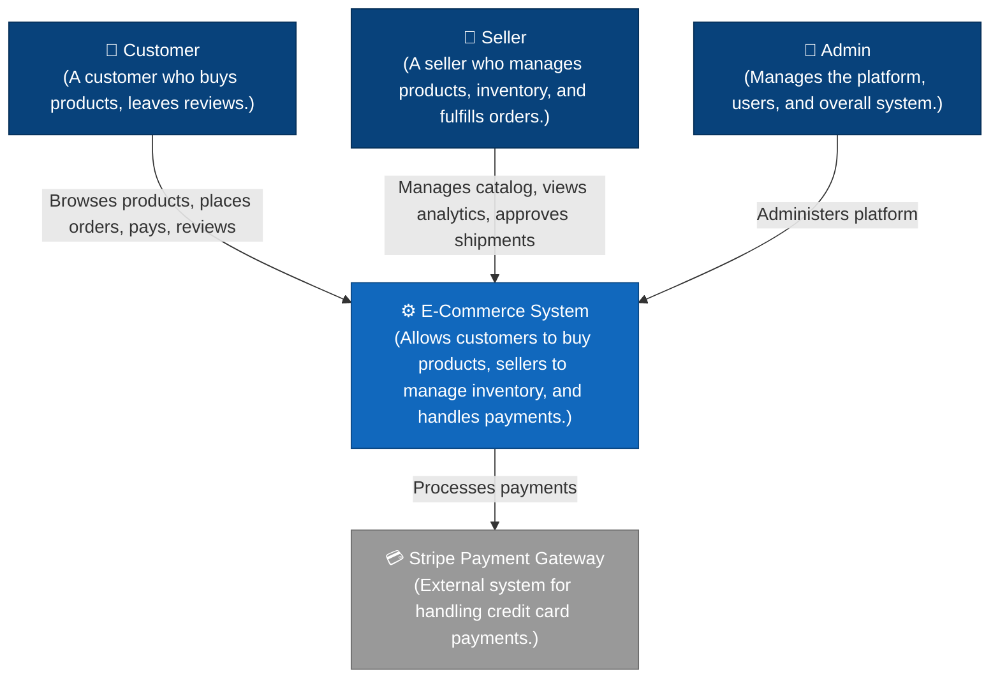
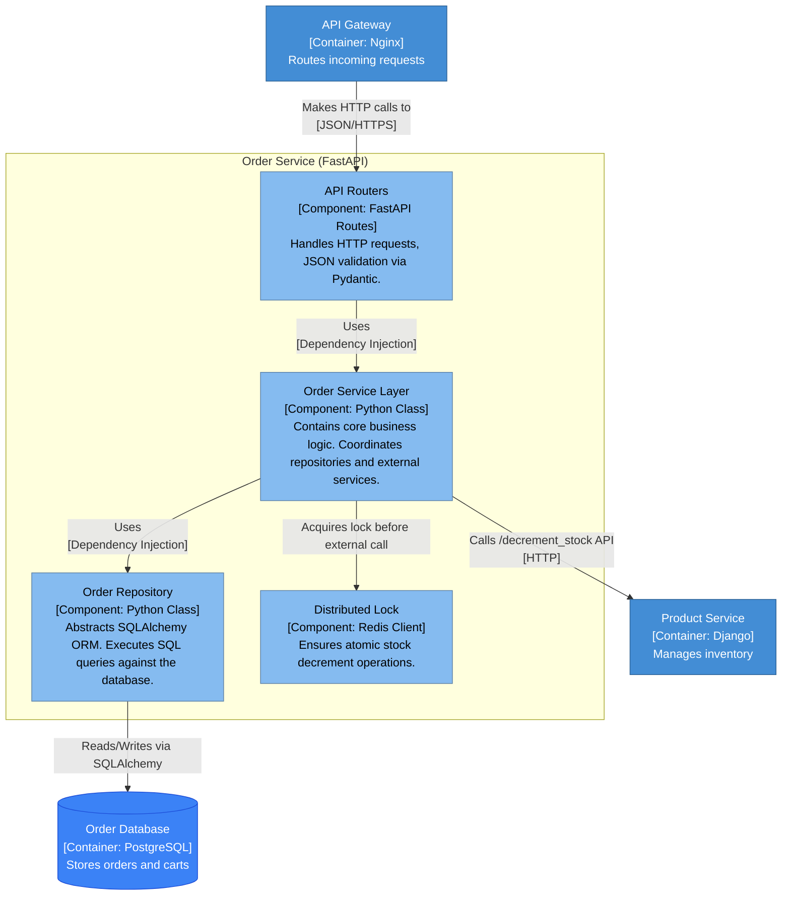
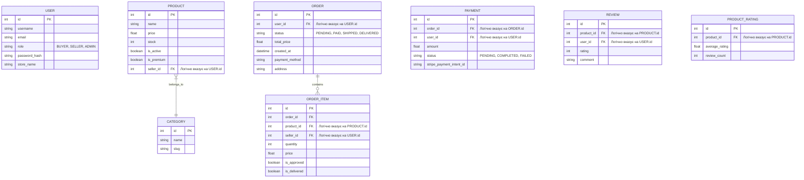
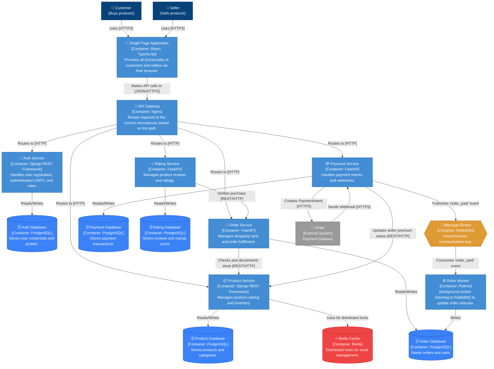
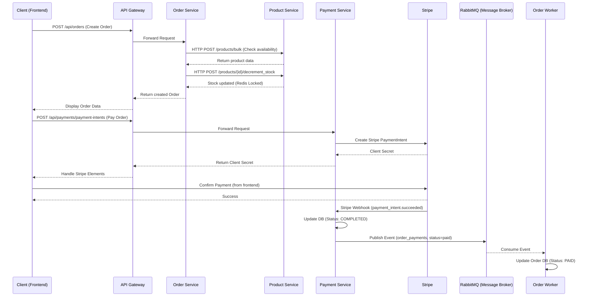

# Архітектура та Дизайн (E-commerce Microservices Ecosystem)

## 1. Архітектурний стиль та Загальний огляд системи

**Вибір:** Мікросервісна архітектура з багатошаровим (Layered/MVC) підходом всередині кожного сервісу.

**Загальний огляд (High-Level Architecture):**
Система складається з Frontend-додатку (React SPA), єдиної точки входу API Gateway (Nginx) та набору ізольованих мікросервісів, які взаємодіють між собою через REST API (синхронно) та RabbitMQ/Redis (асинхронно та кешування). Дані зберігаються в PostgreSQL за принципом "одна база даних на сервіс" (Database per Service).

### C4 Model: Контекст системи (System Context Diagram)

### Опис Мікросервісів

1. **API Gateway (Nginx):** 
   - Виступає як Reverse Proxy.
   - Маршрутизує зовнішні HTTP-запити від Frontend до відповідних мікросервісів (наприклад, `/api/auth/` направляється на `auth_service`).
2. **Auth Service (`auth_service`):** 
   - Відповідає за реєстрацію, автентифікацію (JWT) та управління користувачами (ролі: Buyer, Seller, Admin).
   - **База даних:** `auth_db` (PostgreSQL) — зберігає облікові дані та профілі користувачів.
3. **Product Service (`product_service`):** 
   - Керує каталогом товарів, категоріями, інвентарем (stock) та цінами.
   - **База даних:** `product_db` (PostgreSQL) — містить таблиці продуктів, категорій.
   - **Кешування/Блокування:** Використовує Redis для розподілених блокувань під час зміни залишків товарів.
4. **Order Service (`order_service`):** 
   - Обробляє життєвий цикл замовлення (від створення кошика до підтвердження продавцем та доставки). Включає також `order_worker` для фонової обробки через RabbitMQ.
   - **База даних:** `order_db` (PostgreSQL) — зберігає замовлення (Orders), позиції замовлення (Order Items) та кошики (Carts).
5. **Payment Service (`payment_service`):** 
   - Відповідає за обробку транзакцій (інтеграція з платіжними шлюзами).
   - **База даних:** `payment_db` (PostgreSQL) — фіксує статуси транзакцій та історію платежів.
6. **Rating Service (`rating_service`):** 
   - Дозволяє покупцям залишати відгуки та оцінки на придбані товари.
   - **База даних:** `rating_db` (PostgreSQL) — зберігає відгуки та середні рейтинги.

**Обґрунтування підходу (Database-per-service):** 
Розподіл на незалежні сервіси з власними базами даних забезпечує повну ізоляцію, легке масштабування окремих компонентів та запобігає каскадним відмовам (якщо відмовить сервіс рейтингів, оформлення замовлень працюватиме далі).

---

## 2. Шаблони проєктування (Design Patterns) та Архітектура Компонентів (C4 Component)

В межах кожного мікросервісу (наприклад, `order_service`) використовується багатошарова архітектура (Layered Architecture):

### C4 Model: Діаграма Компонентів (на прикладі Order Service)

У проєкті застосовано наступні шаблони (Gang of Four):
1. **Repository Pattern:** Використовується для абстрагування логіки доступу до бази даних. Наприклад, `OrderRepository` інкапсулює SQL-запити через SQLAlchemy, тому Service Layer не залежить від конкретної бази даних.
2. **Singleton Pattern:** Застосовується для керування підключеннями до бази даних (`engine` в SQLAlchemy) та підключенням до Redis. Об'єкт підключення створюється один раз і перевикористовується для всіх запитів.
3. **Dependency Injection (DI):** Широко використовується через FastAPI `Depends()`, що дозволяє прокидати сесії бази даних та сервіси у контролери, полегшуючи модульне тестування (можна підмінити залежності моками).

---

## 3. Аналіз та дотримання SOLID

- **Single Responsibility Principle (SRP):** Кожен клас/модуль має одну відповідальність. Контролери лише обробляють HTTP, Сервіси - бізнес-логіку, Репозиторії - базу даних.
- **Open/Closed Principle (OCP):** Сутності бази даних (Models) розширюються без зміни існуючого коду. Валідатори Pydantic (DTO) дозволяють розширювати схеми запитів через наслідування.
- **Liskov Substitution Principle (LSP):** Використання абстрактних базових класів (Base в SQLAlchemy) дозволяє замінювати та розширювати моделі без порушення логіки ORM.
- **Interface Segregation Principle (ISP):** Інтерфейси репозиторіїв та сервісів розділені логічно за доменними сутностями.
- **Dependency Inversion Principle (DIP):** Контролери залежать від абстракцій (через FastAPI DI параметри), а не від конкретних реалізацій інстансів класів або з'єднань БД.

---

## 4. Робота з даними, Проєктування БД

**Підхід:** Реляційна SQL база даних (PostgreSQL через єдиний сервер, але з логічним розділенням на `auth_db`, `product_db`, `order_db` тощо).
**Обґрунтування:** E-commerce процеси (особливо замовлення, залишки товарів, платежі) вимагають жорсткої узгодженості даних (ACID), підтримки транзакцій та гарантій консистентності, що робить реляційні SQL бази ідеальним вибором у порівнянні з NoSQL.

### Структура БД (ER-діаграма загальної екосистеми - логічні зв'язки)

Зверніть увагу: фізично бази розділені (Microservice Database Pattern), але логічно сутності пов'язані ідентифікаторами (foreign keys зберігаються як звичайні `INTEGER` поля без жорсткого constraints між БД).

Для взаємодії з БД використовується **SQLAlchemy (ORM)**. 
**DTO (Data Transfer Objects):** Використовується `Pydantic` моделі для передачі та валідації даних між Frontend <-> Controllers <-> Service Layer.

---

## 6. Взаємодія між сервісами (Service Communication) та Паттерни

Система використовує змішаний підхід до взаємодії, імплементуючи **API Gateway Pattern** та **Event-Driven Architecture**:

### C4 Model: Діаграма контейнерів (Container Diagram)

### Синхронна взаємодія (REST API / HTTP)
Використовується там, де необхідна миттєва відповідь для користувача або іншого сервісу:
- **API Gateway -> Microservices:** Всі запити від клієнта (фронтенду) проходять через Nginx, який працює як reverse proxy.
- **Order Service -> Product Service:** При оформленні замовлення `order_service` робить синхронний запит до `product_service` для перевірки наявності товарів та синхронного зменшення їх кількості (за допомогою Redis-блокувань, щоб уникнути race conditions).
- **Rating Service -> Order Service:** Перед тим, як дозволити користувачу залишити відгук, `rating_service` перевіряє через HTTP-запит до `order_service`, чи дійсно користувач придбав цей товар.

### Асинхронна взаємодія (RabbitMQ)
Використовується для фонової обробки, де немає необхідності миттєво чекати результату:
- **Payment Service -> RabbitMQ -> Order Worker:** Після того, як `payment_service` підтверджує оплату через Stripe Webhook, він публікує повідомлення в RabbitMQ (черга `order_payments`). `order_worker` (частина `order_service`) отримує це повідомлення і асинхронно оновлює статус замовлення на `PAID`.

### Діаграма взаємодії (Sequence Diagram) - Оформлення та оплата замовлення

## 7. Безпека

- **Автентифікація та Авторизація:** Використовується механізм бездержавних сесій через JWT (JSON Web Tokens). Токен генерується в `auth_service` і передається в HTTP-заголовках до інших сервісів для ідентифікації користувача.
- **Ролі та Політики доступу (RBAC):** Доступ до певних ендпоінтів жорстко обмежений ролями (наприклад, тільки `Seller` може затверджувати відправку товару, тільки `Admin` може керувати користувачами).
- **Захист від SQL Injection:** Використання ORM (SQLAlchemy та Django ORM) замість "сирих" SQL-запитів автоматично екранує вхідні параметри, роблячи SQL-ін'єкції неможливими на рівні запитів.
- **Захист від XSS:** FastAPI/Pydantic та Django автоматично валідують та очищають вхідні дані на backend. На стороні frontend React автоматично екранує вивід змінних у DOM, запобігаючи XSS-атакам.
- **Управління секретами:** Усі паролі хешуються (Bcrypt/PBKDF2). Паролі до баз даних, JWT секрети та налаштування RabbitMQ не зберігаються в коді, а прокидаються через `.env` файли (Environment Variables) за принципами 12-factor app.